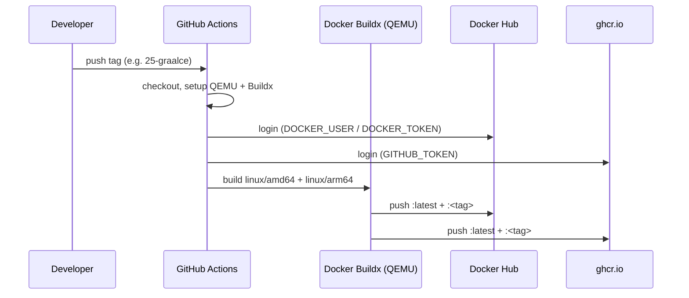

# CI/CD and Release Process

## Image deployment workflow

[`.github/workflows/deploy-image.yml`](/.github/workflows/deploy-image.yml) builds and publishes multi-arch Docker images automatically when any git tag is pushed.

### Trigger

```yaml
on:
  push:
    tags:
      - "*"
```

Pushing **any** tag triggers the build. There is no branch filter — the tag itself determines the image tag name.

### Build pipeline



### Output

Each build pushes to **both** registries with two tags:

| Tag pattern | Example |
|-------------|---------|
| `latest` | `softinstigate/graalvm-maven:latest` |
| `<git-tag>` | `softinstigate/graalvm-maven:25-graalce` |

### Required secrets

| Secret | Used by | Purpose |
|--------|---------|---------|
| `DOCKER_USER` | Docker Hub login | Hub username |
| `DOCKER_TOKEN` | Docker Hub login | Hub access token |
| `GITHUB_TOKEN` | GHCR login | Automatic — no manual setup needed |

## Release process (maintainer steps)

1. Update `ARG JAVA_VERSION` and `ARG MAVEN_VERSION` in [`Dockerfile`](/Dockerfile).
2. Update the version table in [`README.md`](/README.md) to match.
3. Commit and push to `main`.
4. Create and push a git tag matching the GraalVM version (e.g. `25-graalce`):
   ```bash
   git tag 25-graalce
   git push origin 25-graalce
   ```
5. GitHub Actions builds and publishes the image automatically.

## OpenWiki automation

[`.github/workflows/openwiki-update.yml`](/.github/workflows/openwiki-update.yml) runs a scheduled OpenWiki documentation refresh:

- **Schedule:** daily at 08:00 UTC (`cron: "0 8 * * *"`)
- **Trigger:** also available via `workflow_dispatch`
- **Process:** checks out the repo, installs OpenWiki globally, runs `openwiki code --update --print`, then opens a PR on the `openwiki/update` branch with any documentation changes.
- **PR scope:** changes under `openwiki/`, `AGENTS.md`, `CLAUDE.md`, and the workflow file itself.

The workflow uses OpenRouter as the LLM provider (configured via `OPENROUTER_API_KEY` secret).

## Relationship to Dockerfile

The CI workflow consumes the Dockerfile as-is — it does not override `ARG` values at build time. This means the version `ARG`s in the Dockerfile are the sole source of truth for what gets installed in the published image.
